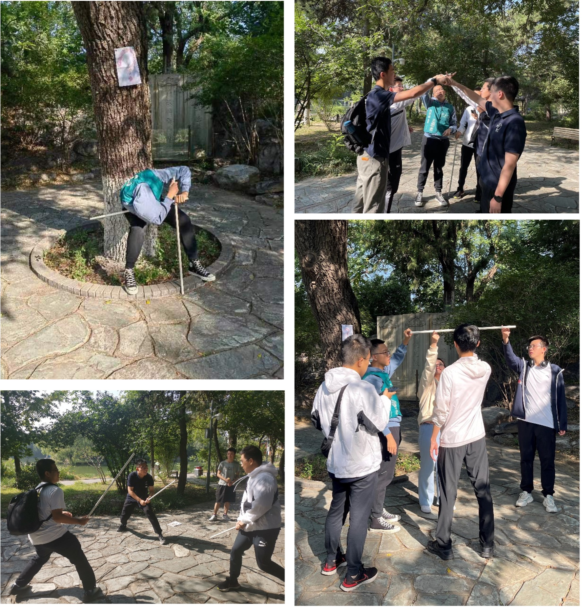

# 2022物院新生定向越野圆满结束

&emsp;&emsp;年年岁岁花相似，岁岁年年人不同。又是一年开学季，又是定向越野时。今年的定向越野活动有50多位物院新生报名参赛，探索北大的每一个角落，邂逅校园中的美丽风景与悠久历史。
早晨8:30，随着第一批队伍的出发，定向越野赛正式开始。一个个少年和少女充满斗志，神采飞扬，按照地图的指引，向着各个任务点奔去。

## 地图如下

&emsp;&emsp;可以看到定向越野过程中共设置八个任务点，各有一个趣味小游戏
&emsp;&emsp;***快来看看大家的精彩瞬间叭～***

## 主线1、拓扑手环

### 游戏规则

&emsp;&emsp;游戏开始时，四个人站在一起闭上眼，伸出双手，由场务任意组合8只手，听到口令“睁眼”后，4位同学睁眼并通过各种方式将手环解开，但不能松手，直到四个人围成一个环，计时评分。
&emsp;&emsp;_同学们用曼妙的舞姿分离了交缠的肢体，解开了拓扑学的难题。_

## 主线2、同心棍

### 游戏规则

&emsp;&emsp;四人分为两组，相向站立，每人伸出一只手指，大家共同将一根水平的长棍子从某一高度放到地上，计时评分。
&emsp;&emsp;_未名湖的湖中仙女将强大的物理学圣剑交到了勇者手中，他们能顺利将圣剑接引到地面吗?_

## 主线3、砸沙包

### 游戏规则

&emsp;&emsp;每人两个沙包，在5m之外投掷击倒纸箱金字塔，以击倒纸箱个数计分。
&emsp;&emsp;_最终没有小组能将纸箱全部击倒，大家对抛物线的计算还有待提高啊。_

## 主线4、吹乒乓

### 游戏规则

&emsp;&emsp;提供两个装满水的纸杯，三个人参与，其中两个人端稳水杯，一个人将乒乓球从一个水杯吹入另一个水杯，掉落即停，中途不允许向杯中加水。
&emsp;&emsp;_小球在空中飞跃短暂而美妙的弧线，同学们的心也随之一起一落；地面上的水渍逐渐扩大，杯中的水面一点点下降，焦急的情绪又在不经意间升起_

## 主线5、四人两足

### 游戏规则

&emsp;&emsp;4人一组，在地上一个方形区域内根据指令相互配合使规定部位着地完成动作，每个动作必须定格三秒才算过关。
&emsp;&emsp;_同学们的身体缠缠绵绵，交错纵横，饱受肌肤相亲之苦，到底是谁想出来的这么离谱的游戏啊（对啊是谁啊，笑）。_

## 主线6、激光反射

### 游戏规则

&emsp;&emsp;一人背上贴带区域标记的A4纸，手持激光笔，其余三人各持一面小镜子，将激光成功沿要求的光路反射至A4纸上特定区域上并保持5秒则成功。
&emsp;&emsp;_大家都忘了基本光路知识了吗？不过话说回来，直接拿激光笔往身后一照这个bug，啊这是可以做的吗？_

## 主线7、数字游戏

### 游戏规则

&emsp;&emsp;参与者站成一排，每个人会按照一定规律对应一些数字，当喊出某个正数时，离该数字最近的玩家需要喊“到”。
&emsp;&emsp;_反应快的同学也许发现了规律，但当第一个数字报出来的那一刻所有人几乎无一例外的大脑过载，啊呀口算eπ也不是不可以的嘛。_

## 主线8、空气动力学飞机

### 游戏规则

&emsp;&emsp;每组四个人分别叠好一架纸飞机并放飞，每人只能得到一张纸。
&emsp;&emsp;_静园的草坪之上，飞扬的纸飞机承载着我们的梦想，自由的翱翔于蓝天之上（~~然后重重摔倒地上~~），每个人的童年都少不了纸飞机的陪伴，而它也永远寄托着我们的希望。_

&emsp;&emsp;在完成主线任务后，同学们可以获得一些神秘字母和照片。照片可以解锁燕园之中的隐藏点，进一步帮助同学们探索校园，而字母可以拼成——

***
WELCOM TO PKUPHYS!
***

&emsp;&emsp;哈哈，希望各位新生在本次活动中能更好的熟悉校园，熟悉北大，也能认识更多的朋友，留下美好的回忆。
最后，欢迎来到北大物院！

