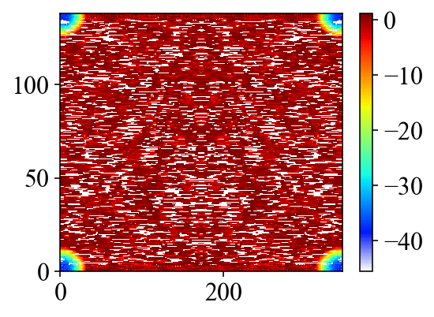

## 自相关

```python

from scipy import signal
rng = np.random.default_rng()
sig = rng.standard_normal(1000)
autocorr = signal.fftconvolve(sig, sig[::-1], mode='full')

```

## 高斯滤波

```python
import scipy
from scipy.ndimage import gaussian_filter
import scipy.signal as signal

c = 3e8
dx = 1e-6 * (x[1] - x[0])
sigma = c/10e12/dx

EyTHz = scipy.ndimage.gaussian_filter(EyEnd, sigma = 15)

```

使用高斯核卷积进行滤波

```python

im = EyEnd
gauss_kernel = np.outer(signal.gaussian(im.shape[0], 15), signal.gaussian(im.shape[1], 15))
#gauss_kernel = gauss_kernel/np.sum(gauss_kernel)
gauss_kernel /= np.trapz(np.trapz(gauss_kernel))
im_real = signal.convolve(im, gauss_kernel, mode='same')
#im_real = im * gauss_kernel

```

其中sigma为滤波宽度

## 使用卷积实现滤波

```python

import numpy as np
from scipy import signal
#from scipy import misc
import matplotlib.pyplot as plt

####动态模糊核心
guass_kernal = [[0, 0, 1],
                [0, 1, 0],
                [1, 0, 0]]

result = signal.convolve2d(origin, guass_kernal, boundary='symm', mode='same')

```

二维的卷积运算还有一种函数，是signal.sepfir2d()，它可以传入三个参数，后两个参数指定行和列的卷积和(两个方向上的卷积是可以不同的，分别指定卷积和序列)。


## 频域卷积

```python

from scipy import signal
import numpy as np
import numpy.fft as fp

im = EyEnd #EyEnd为需要滤波的图像

gauss_kernel = np.outer(signal.gaussian(im.shape[0], 15), 
signal.gaussian(im.shape[1], 15))

plt.pcolormesh(gauss_kernel, cmap = 'jet')

freq = np.fft.fft2(im)
assert(freq.shape == gauss_kernel.shape)
freq_kernel = np.fft.fft2(np.fft.ifftshift(gauss_kernel))

fig = plt.figure(figsize = (10, 4))
ax_1 = fig.add_subplot(121, projection='3d')
ax_2 = fig.add_subplot(122, projection='3d')
 
Y = np.arange(0 - int(im.shape[0]/2), im.shape[0] - int(im.shape[0]/2), 1)
X = np.arange(0 - int(im.shape[1]/2), im.shape[1] - int(im.shape[1]/2), 1)
X, Y = np.meshgrid(X, Y)
 
ax_1.plot_surface(X, Y, np.log10(np.abs(fp.ifftshift(freq))), rstride=4,
cstride=4, cmap=plt.cm.coolwarm)
 
ax_2.plot_surface(X, Y, np.abs(fp.ifftshift(freq_kernel)), rstride=4,
cstride=4, cmap=plt.cm.coolwarm)
plt.show()

conv = freq*freq_kernel
im1 = fp.ifft2(conv).real

```

简洁版

```python

from scipy import signal
import numpy as np
import numpy.fft as fp

def fftConv(im, sigma):

    gauss_kernel = np.outer(signal.gaussian(im.shape[0], sigma), 
    signal.gaussian(im.shape[1], sigma))
    plotFreq(freqX, freqY, gauss_kernel.T)

    freq = np.fft.fft2(im)
    assert(freq.shape == gauss_kernel.shape)
    freq_kernel = np.fft.fft2(np.fft.ifftshift(gauss_kernel))
    #freq_kernel = np.fft.fft2(gauss_kernel)
    plotField(freqX, freqY, np.log10(np.abs(fp.ifftshift(freq))).T)
    plotFreq(freqX, freqY, np.abs(fp.ifftshift(freq_kernel)).T) 

    conv = freq*freq_kernel
    im1 = fp.ifft2(conv).real
    return im1

im = EyEnd
plotField(x, y, im.T)
sigma = 15
im1 = fftConv(im, sigma)
plotField(freqX, freqY, im1.T) 

```


时域和频域对比

```python

import matplotlib.pyplot as pylab

freq = np.fft.fft2(im)
assert(freq.shape == gauss_kernel.shape)
freq_kernel = np.fft.fft2(np.fft.ifftshift(gauss_kernel))
conv = freq * freq_kernel
im1 = fp.ifft2(conv).real

pylab.figure(figsize = (20, 8))
pylab.gray()
pylab.subplot(2, 3, 1), pylab.pcolormesh(im.T, cmap = 'bwr'), pylab.title('Original Image', size = 30), pylab.axis('off')
pylab.subplot(2, 3, 2), pylab.pcolormesh(gauss_kernel.T, cmap = 'jet'), pylab.title('Gaussian Kernel', size = 30), pylab.axis('off')
pylab.subplot(2, 3, 3), pylab.pcolormesh(im1.T, cmap = 'bwr'), pylab.title('Output Image', size = 30), pylab.axis('off')

imOrigin = (20*np.log10(np.abs(0.1+fp.ifftshift(freq)))).astype(int)
pylab.subplot(2, 3, 4), pylab.pcolormesh(imOrigin.T, cmap = 'bwr')
pylab.title('Origin Image Spectrum', size = 30), pylab.axis('off')

imGuassian = (20*np.log10(np.abs(0.1+fp.ifftshift(freq_kernel)))).astype(int)
pylab.subplot(2, 3, 5), pylab.pcolormesh(imGuassian.T, cmap = 'jet')
pylab.title('Gaussian Kernel Spectrum', size = 30), pylab.axis('off')

imOutSpec = (20*np.log10(np.abs(0.1+fp.ifftshift(conv)))).astype(int)
pylab.subplot(2, 3, 6), pylab.pcolormesh(imOutSpec.T, cmap = 'jet')
pylab.title('Output Image Spectrum', size = 30), pylab.axis('off')

```

## 带通滤波

在这里尝试使用高斯差分核（两个高斯核的差），作为带通滤波器。带通滤波是保留一定频段内的频率分量，而丢弃其余所有的频率分量。

```python
###读取图像
im = img_as_float(pylab.imread('./images/snow.jpg'))
pylab.figure(), pylab.imshow(im), pylab.axis('off'), pylab.show()
x = np.linspace(-10, 10, 15)
###kernel 1 生成
kernel = np.exp(-0.005*x**2)
kernel /= np.trapz(kernel)
guass_kernel_1 = kernel[:, np.newaxis] * kernel[np.newaxis, :]
###kernel 2 生成
kernel = np.exp(-5*x**2)
kernel /= np.trapz(kernel)
guass_kernel_2 = kernel[:, np.newaxis] * kernel[np.newaxis, :]
###进行差分
DOGkernel = guass_kernel_1[:,:,np.newaxis] - guass_kernel_2[:,:,np.newaxis]
###卷积
im = signal.fftconvolve(im, DOGkernel, mode = 'same')
pylab.figure, pylab.imshow(np.clip(im, 0, 1)), pylab.axis('off'), print(np.max(im))
pylab.show()

```


