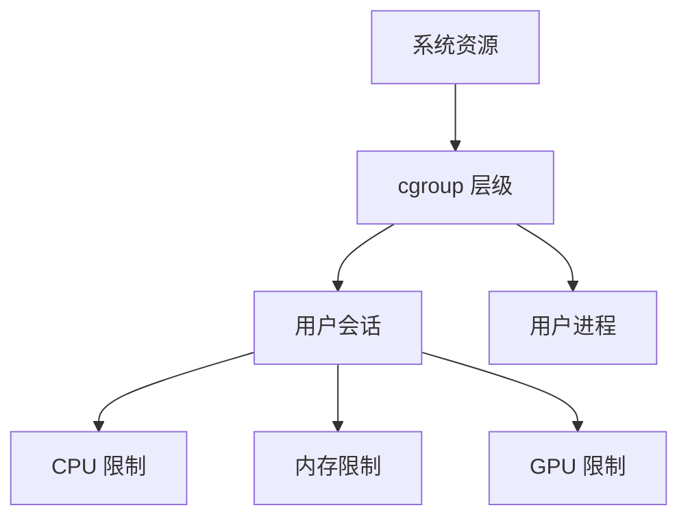

本文详细介绍如何使用 cgroup 对 SSH 登录用户进行资源限制，包括 CPU、内存和 GPU 资源的配额管理。

## 一、cgroup 限制原理

### 1. 资源控制层次


### 2. 关键组件
| 组件 | 功能 | 配置文件 |
|------|------|----------|
| cgconfig | cgroup 定义 | `/etc/cgconfig.conf` |
| cgred | 规则引擎 | `/etc/cgrules.conf` |
| pam_cgroup | PAM 集成 | `/etc/pam.d/sshd` |

## 二、基础环境配置

### 1. 安装必要工具
```bash
# CentOS/RHEL
sudo dnf install libcgroup libcgroup-tools

# Ubuntu/Debian
sudo apt install cgroup-tools cgroupfs-mount
```

### 2. 启用 cgroup 服务
```bash
sudo systemctl enable cgconfig
sudo systemctl enable cgred
```

## 三、SSH 用户资源限制配置

### 1. 创建 cgroup 模板
编辑 `/etc/cgconfig.conf`：
```conf
# CPU 限制（相对权重）
group ssh_limit/cpu {
    cpu {
        cpu.shares = 512;  # 默认1024，值越小权重越低
    }
}

# 内存限制（硬限制）
group ssh_limit/memory {
    memory {
        memory.limit_in_bytes = 8G;
        memory.memsw.limit_in_bytes = 16G;  # 包含交换空间
    }
}

# CPU 核绑定
group ssh_limit/cpuset {
    cpuset {
        cpuset.cpus = "0-3";  # 只允许使用0-3号CPU核心
        cpuset.mems = "0";    # NUMA节点
    }
}
```

### 2. 配置用户映射规则
编辑 `/etc/cgrules.conf`：
```conf
# 格式：用户:进程 控制器组 路径
*:user1  cpu,memory,cpuset  ssh_limit/
*:user2  cpu,memory,cpuset  ssh_limit/
*:@devteam  cpu,memory,cpuset  ssh_limit/  # 用户组
```

### 3. 集成 SSH 认证
编辑 `/etc/pam.d/sshd`：
```conf
# 在 session 部分添加
session    required     pam_cgroup.so
```

### 4. 重启服务
```bash
sudo systemctl restart cgconfig cgred sshd
```

## 四、GPU 资源限制（NVIDIA）

### 1. 安装 GPU cgroup 工具
```bash
# NVIDIA 专用工具
sudo dnf install nvidia-cgroup-tools

# 或手动配置
sudo mkdir /sys/fs/cgroup/devices/gpu_limited
```

### 2. 配置 GPU 设备规则
```bash
# 禁止所有GPU设备
echo 'c 195:* rwm' | sudo tee /sys/fs/cgroup/devices/gpu_limited/devices.deny

# 按需允许特定设备
echo 'c 195:0 rwm' | sudo tee /sys/fs/cgroup/devices/gpu_limited/devices.allow  # /dev/nvidia0
echo 'c 195:1 rwm' | sudo tee /sys/fs/cgroup/devices/gpu_limited/devices.allow  # /dev/nvidia1
```

### 3. 用户 GPU 配额
在 `/etc/cgrules.conf` 添加：
```conf
*:gpu_user  devices  gpu_limited/
```

## 五、资源使用监控

### 1. 实时查看 cgroup 状态
```bash
# CPU 使用
cgget -g cpu:ssh_limit/cpu

# 内存使用
cgget -g memory:ssh_limit/memory

# GPU 设备访问
cgget -g devices:gpu_limited
```

### 2. 生成资源报告
```bash
# 每小时记录资源使用
*/60 * * * * root cgget -g cpu,memory:ssh_limit/ > /var/log/cgroup-usage.log
```

## 六、高级配置技巧

### 1. 动态调整限制
```bash
# 临时增加内存配额（8G → 12G）
cgset -r memory.limit_in_bytes=12G ssh_limit/memory

# 永久修改需更新 /etc/cgconfig.conf
```

### 2. 用户组配额继承
```conf
# 父组定义
group parent_group {
    cpu {
        cpu.shares = 1024;
    }
}

# 子组继承
group parent_group/child_group {
    cpu {
        cpu.shares = 512;
    }
}
```

## 七、常见问题排查

### 1. SSH 登录后无限制
**检查点**：
1. `pam_cgroup` 是否在 `/etc/pam.d/sshd` 中启用
2. 用户是否在 `/etc/cgrules.conf` 中定义
3. cgred 服务状态：`systemctl status cgred`

### 2. GPU 设备访问被拒
**解决步骤**：
```bash
# 查看设备权限
cgget -g devices:gpu_limited

# 添加缺失设备
echo 'c 195:2 rwm' | sudo tee /sys/fs/cgroup/devices/gpu_limited/devices.allow
```

### 3. 内存超限处理
配置 OOM 通知：
```conf
# /etc/cgconfig.conf
group ssh_limit/memory {
    memory {
        memory.oom_control = 1;  # 启用OOM通知
    }
}
```

监控 OOM 事件：
```bash
sudo tail -f /var/log/messages | grep -i oom
```

> 本文档更新日期：2025-12-21  
> 适用系统：CentOS/RHEL 8+, Ubuntu 20.04+
